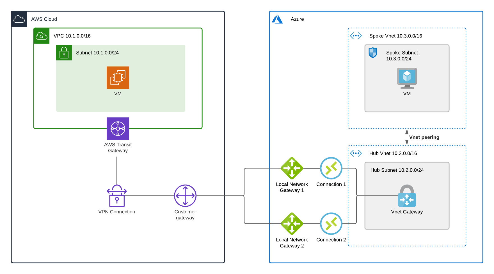

# AWS-to-Azure VPN

Deploys a site-to-site VPN between AWS and Azure using [Terraform](https://www.terraform.io).

The Azure side uses a standard
[hub-and-spoke topology](https://docs.microsoft.com/en-us/azure/architecture/reference-architectures/hybrid-networking/hub-spoke)
where the hub vnet contains a
[VPN gateway](https://docs.microsoft.com/en-us/azure/vpn-gateway/) that routes traffic between
the VPN and the peered spoke vnet. The AWS side uses a
[transit gateway](https://docs.aws.amazon.com/vpc/latest/tgw/what-is-transit-gateway.html)
to connect a VPC to the VPN. All routing in this example is static, i.e. we explicitly
configure the remote IP ranges to route to rather than advertising them over BGP (this would
be a good future enhancement).

## Architecture



## Code Structure

The code deploys AWS and Azure resources in parallel using the respective Terraform providers,
with resources referencing each other's attributes as needed. Terraform's dependency management
takes care of ordering resource creation with one important exception, the public IP address of
the Azure VPN gateway.

The difficulty is that VPN gateways only support
[dynamically-allocated](https://docs.microsoft.com/en-us/azure/virtual-network/public-ip-addresses#allocation-method)
public IPs, meaning that the
[azurerm_public_ip resource](https://www.terraform.io/docs/providers/azurerm/r/public_ip.html)
is created with a null `ip_address` attribute. This attribute is only assigned after the VPN
gateway is created, so it needs to be read using an
[azurerm_public_ip data source](https://www.terraform.io/docs/providers/azurerm/d/public_ip.html)
rather than referenced as a resource attribute. Because AWS assigns its public IPs as attributes
of the VPN connection, not the VPN gateway, we need to create things in this order:

1. Create `azurerm_public_ip` and `aws_ec2_transit_gateway` resources in parallel
1. Create `azurerm_virtual_network_gateway` resource
1. Read `azurerm_public_ip` data source to get the allocated IP address
1. Create `aws_customer_gateway` resource with the Azure public IP address
1. Create `aws_vpn_connection` resource connecting the transit gateway and customer (Azure) gateway
1. Create `azurerm_local_network_gateway` resources with the primary and seconday AWS tunnel IPs
(attributes of the `aws_vpn_connection` resource)
1. Create `azurerm_virtual_network_gateway_connection` resources connecting the Azure VPN gateway and
local (AWS) gateways

As explained under
[Data Source Lifecycle](https://www.terraform.io/docs/configuration/data-sources.html#data-source-lifecycle),
a data source can either be read in the "refresh" phase of an apply (prior to creating any resources)
or it can depend on computed values in which case it is read during the "apply" phase. Clearly the first option
won't work in our case since we specifically don't want to read the data source until the underlying resource
has its `ip_address` populated. Reading it during the apply phase is also problematic, however, because as
noted in the docs any resources that depend on the data source will now reference "computed" (i.e. unknown)
values - the practical effect of this is that our `aws_customer_gateway` resource and its dependencies will
be needlessly destroyed and recreated every time we run an apply!

Since the data source has to be read during the refresh phase but after IP address allocation, the only solution
is to break the deployment into multiple stages. The [first stage](stage1/) creates the Azure VPN gateway and
everything else that doesn't depend on its IP address, then the [second stage](stage2/) starts by reading the
address from the data source before creating everything that depends on it. While this is an annoyance for our
toy example, in reality an organisation would likely create the Azure and AWS sides of the VPN using separate
codebases, deployment pipelines and even engineering teams, so this sort of multi-stage deployment is to be
expected.

Because each stage manages its own [Terraform state](https://www.terraform.io/docs/state/index.html) we use
the Terraform provider's
[remote_state data source](https://www.terraform.io/docs/providers/terraform/d/remote_state.html)
to pass attributes from the first stage to the second. There's a trade-off here around resources that could
be created in either stage: the more resources in the first stage the more we have to access remote state, but
the more in the second stage the more we have to pass through input variables. I've chosen to create as much as
possible in the first stage for two reasons: this makes it easier to supply all variables in a single place, and
it lets more resources be created while the Azure VPN gateway is deploying (which can take 45 minutes or longer).

## Testing

Once you've authenticated to both clouds (same as you would for CLI access), run
```
terraform init
terraform apply
```
in `stage1`, then again in `stage2` once the first apply completes.

To prove that the connection works, this code deploys a VM on each side that you can SSH into
by public IP. For AWS, log in as `ubuntu` with an existing EC2 key pair (specified in
[terraform.tfvars](stage1/terraform.tfvars)), and for Azure log in as `adminuser` using the
password generated as an output of the `stage1` deployment. To control SSH access set the
`admin_cidr` variable.

From each VM you can then SSH to the other's private IP across the VPN. All these IP addresses
are available as [outputs](https://www.terraform.io/docs/commands/output.html) of the `stage1`
deploynent.
